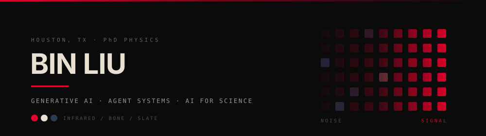
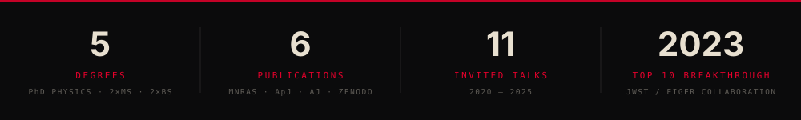

<div align="center">

<picture>
  <source media="(prefers-color-scheme: dark)" srcset="./assets/banner-dark.svg">
  <source media="(prefers-color-scheme: light)" srcset="./assets/banner-light.svg">
  
</picture>

<a href="https://binliu14.com/">
  
</a>

<p>
  <a href="https://www.linkedin.com/in/binliu14/"></a>
  <a href="https://binliu14.com/"></a>
  <a href="https://binliu14.com/cv/"></a>
  <a href="mailto:binliu14qd@gmail.com"></a>
  <a href="https://binliu14.com/kicks/"></a>
  
</p>

</div>

---

```console
bin@houston ~ % whoami
Dr. Bin Liu — AI research engineer and manager. Physics PhD. Houston, TX.

bin@houston ~ % ./what-i-actually-do
Agentic AI architecture, generative vision, and multimodal systems for heavy industry.
Before that: deep learning on data from the James Webb Space Telescope.

bin@houston ~ % ./impact --annual
$8M saved · $15M losses prevented · $20M revenue growth · 2 weeks compressed to 10 minutes

bin@houston ~ % _
```

<div align="center">
<picture>
  <source media="(prefers-color-scheme: dark)" srcset="./assets/impact-dark.svg">
  <source media="(prefers-color-scheme: light)" srcset="./assets/impact-light.svg">
  
</picture>
</div>

<br>

## ◤ WHAT I BUILD

<table>
<tr>
<td width="50%" valign="top">

### ▸ Agentic AI systems
Agent swarms wired into knowledge graphs. GraphRAG over Neo4j. MCP and A2A protocols. Root-cause reasoning that goes past tool-calling.

I architect these for enterprise platforms, then I run the team that ships them.

</td>
<td width="50%" valign="top">

### ▸ Generative vision
Diffusion for super-resolution and controllable synthesis. NeRF and 3D Gaussian Splatting. SDXL, Flux.1, ControlNet, SAM2 composed into pipelines that survive real clients.

</td>
</tr>
<tr>
<td width="50%" valign="top">

### ▸ AI for science
Five years of deep learning on the James Webb Space Telescope with the EIGER collaboration — spectroscopy, Bayesian inference, and the research software other astronomers actually run.

</td>
<td width="50%" valign="top">

### ▸ Multimodal & industrial ML
Fusing IoT sensor streams with text reports. Transformer vision models on terabytes of CT data. LLM fine-tuning with LoRA, RAG, and RLHF against documents nobody wants to read.

</td>
</tr>
</table>

<br>

## ◤ WHERE I'VE DONE IT

| | Role | |
|---|---|---|
| **BKO AI** <sub>Houston, TX</sub> | Senior AI Manager → previously AI Technology Manager, and Principal AI Research Engineer on the technical core | <sub>Oct 2024 — present</sub> |
| **Shell International Exploration & Production** <sub>Houston, TX</sub> | AI Research Scientist | <sub>Oct 2022 — Oct 2024</sub> |
| **North Carolina State University** <sub>Raleigh, NC</sub> | PhD Research Assistant — James Webb Space Telescope, EIGER Collaboration | <sub>Aug 2019 — Oct 2022</sub> |

<br>

## ◤ WHAT IT WAS WORTH

| Built | Result |
|---|---|
| Multimodal predictive maintenance — IoT signals fused with text reports | **92% accuracy**, downtime down **40%**, **$15M/yr** in losses prevented |
| Legal document automation — LLaMA-3.2 with LoRA, RAG, RLHF, self-reflection | **2 weeks → 10 minutes**, **$8M/yr** saved |
| 3D vision at scale — transformer UVMs over 10 TB of 4K CT scans | **0.841 mIoU** on severe class imbalance, **$20M/yr** revenue growth |
| Generative super-resolution — diffusion models for rock imaging | up to **32×**, **3 days → 15 minutes** |
| GraphRAG for CAD retrieval and budget estimation — Neo4j on Azure | planning accuracy **+55%**, retrieval latency **−40%** |
| Agentic delivery under my technical leadership | delivery timelines **30% faster** |

<sub>Full detail, with dates and scope, on my [CV](https://binliu14.com/cv/).</sub>

<br>

## ◤ SELECTED WORK

### [CodeSense](https://github.com/lblogan14/CodeSense) · <sub>`npm i -g @binliu14/code-sense` · v0.4.0 · MIT</sub>

Turns hardware you already own into a tactile control surface for Claude Code. Approve a tool call by squeezing an analog trigger against real resistance. Read agent state off the lightbar. Feel it finish. Push-to-talk when typing is slower than speaking.

DualSense and M5Stack CoreS3 ship behind one adapter interface, so neither device knows the other exists. Mock device mode means the whole thing develops with no hardware plugged in.

<sub>`TypeScript` · `pnpm monorepo` · `HID over USB/Bluetooth` · `WebSocket` · `Vite + React`</sub>

### [Scientist-Bin](https://github.com/lblogan14/Scientist-Bin)

Hand it a dataset and an objective in plain English. Five agents — router, analyst, planner, executor, reporter — profile the data, propose a plan, wait for you to approve it, then train, evaluate, and write the report. The approval gate exists because agents shouldn't get to spend your compute unsupervised.

Real-time training telemetry over SSE. Every run leaves behind artifacts, metrics, and a decision journal.

<sub>`LangGraph` · `FastAPI` · `Gemini` · `scikit-learn` · `React 19` · `shadcn/ui` · `Zustand`</sub>

### [general-trade-chat](https://github.com/lblogan14/general-trade-chat)

Three agents — technical, social sentiment, macro/search — analyze the market independently and emit a structured, confidence-weighted signal. A synthesis node aggregates them into one actionable call.

The aggregation math is independent of agent count, so adding a fourth analyst is a config change, not a rewrite. Runs headless on cron or through a dark control-center dashboard.

<sub>`LangGraph.js` · `Hono` · `Postgres + Drizzle` · `React 19` · `TanStack Query` · `Node 22 ESM`</sub>

### [rbcodes](https://github.com/rongmon/rbcodes) — <sub>186 commits · #2 of 5 contributors · cited on Zenodo</sub>

Spectroscopic analysis tooling for astrophysics, maintained in [Rongmon Bordoloi's](https://github.com/rongmon) lab and published as *rbcodes v0.2: JWST/NIRCam Grism Spectroscopic Analysis* (Zenodo, 2022). **I don't own this repo, which is exactly why it's here — the contribution is verifiable on someone else's project.**

My work is the interactive 2D-spectra GUI: redshift estimation and error propagation, customizable Gaussian2D kernel smoothing, paired 1D/2D FITS discovery, frame-synchronized axis limits, and a long tail of scaling and colorbar bugs that only surface on real telescope data. Built during my PhD against data from a $10B space telescope.

<sub>`Python` · `PyTorch` · research software used by working astronomers</sub>

<details>
<summary><b>Four more from industry</b> — client work, described at the level I'm allowed to describe it</summary>

<br>

| Project | What it does |
|---|---|
| **E-Commerce Generative AI Suite** <sub>2022–present</sub> | StableDiffusionXL, Flux.1, ControlNet and SAM2 composed into a controllable 8K product-image pipeline. **50+ clients.** |
| **Virtual Influencer Pipeline** <sub>2022–present</sub> | GPT-SoVITS + Kling AI for multilingual virtual influencers. Video customization down to **6 hours**. |
| **Digital Twin with Gaussian Splatting** <sub>2023–2024</sub> | Sneaker digital-twin reconstruction using NeRF and 3D Gaussian Splatting at **97% geometric accuracy**. Yes, the sneakers and the research are the same hobby. |
| **Autonomous Navigation System** <sub>2020–2022</sub> | NVIDIA Jetson, LIDAR and ZED cameras with vSLAM. **0.05 s** end-to-end navigation latency. |

</details>

<details>
<summary><b>Two more, honestly labeled</b></summary>

<br>

**[OntDrill](https://github.com/lblogan14/OntDrill)** — *early stage.* Ontology-driven athletic training design: a knowledge graph reasons about weightlifting and basketball drills instead of looking them up in a template table. Backend ontology schema is written in Cypher; the frontend is still an open question. Posting it half-built on purpose.
<sub>`Neo4j` · `Cypher` · ontology modeling</sub>

**[ICanDoAllThings](https://github.com/lblogan14/ICanDoAllThings)** — *learning in public.* 142 commits of building things from scratch to actually understand them: SwiftUI, Azure, Docker, FastAPI, Hugging Face, LangChain, LangGraph, Neo4j. Not a portfolio piece. A receipt for how the breadth above got there.

</details>

<details>
<summary><b>◤ THE FULL SHELF</b> — 36 repos of mine, plus 80 forks I actually read</summary>

<br>

| Repo | |
|---|---|
| [BinWorkout](https://github.com/lblogan14/BinWorkout) | AI workout app — weightlifting + basketball. `Flutter` |
| [inf-canvas-agent](https://github.com/lblogan14/inf-canvas-agent) | Ideation agent for an infinite canvas. `Python` |
| [essential-graphrag](https://github.com/lblogan14/essential-graphrag) | GraphRAG, worked end to end |
| [auto-image](https://github.com/lblogan14/auto-image) | Image automation for Shopify |
| [wechat-reservation-mini-program](https://github.com/lblogan14/wechat-reservation-mini-program) | Calendar-backed reservation system |
| [CheeseCoder](https://github.com/lblogan14/CheeseCoder) | Named after my ferret. Yes, really. |
| [linkedin-translator](https://github.com/lblogan14/linkedin-translator) | For fun. Do not take seriously. |
| [build_a_large_language_model_from_scratch](https://github.com/lblogan14/build_a_large_language_model_from_scratch) | LLM internals, from first principles |
| [deep_learning_for_computer_vision](https://github.com/lblogan14/deep_learning_for_computer_vision) | CV deep learning notebooks |
| [PyTorch_Recipes](https://github.com/lblogan14/PyTorch_Recipes) | PyTorch patterns worth keeping |
| [CDSA2022_CompCourse](https://github.com/lblogan14/CDSA2022_CompCourse) | Course materials I authored — ‹TK: for whom, how many students?› |

</details>

<br>

## ◤ RESEARCH

<details open>
<summary><b>Publications & award</b></summary>

<br>

🏆 **Top 10 Breakthroughs of the Year, 2023** — EIGER Collaboration, James Webb Space Telescope

1. **B. Liu**, R. Bordoloi. *A Deep Learning Approach to Quasar Continuum Prediction.* **Monthly Notices of the Royal Astronomical Society**, Vol. 502, Issue 3, April 2021, pp. 3510–3532. <sub>first author</sub>
2. **B. Liu**. *Study of Intergalactic Medium Using Spectroscopy and Photometry with Deep Learning.* PhD Thesis, NC State University.
3. R. Bordoloi, **B. Liu**. *rbcodes v0.2: JWST/NIRCam Grism Spectroscopic Analysis API.* **Zenodo**, October 2022.
4. R. Bordoloi, R. A. Simcoe, J. Matthee, D. Kashino, R. Mackenzie, S. J. Lilly, A.-C. Eilers, **B. Liu**, D. DePalma, M. Yue, R. P. Naidu. *EIGER IV. The Cool 10⁴ K Circumgalactic Environment of High-redshift Galaxies Reveals Remarkably Efficient Intergalactic Medium Enrichment.* **The American Astronomical Society**, Vol. 963, Number 1, p. 28, 2024.
5. B. Greig, S. E. I. Bosman, F. Davies, D. Durovcikova, H. Fathivavsari, **B. Liu**, R. A. Meyer, Z. Sun, V. D'Odorico, S. Gallerani, A. Mesinger, Y.-S. Ting. *Blind Quasar Reconstruction Challenge: Exploring Methods to Reconstruct the Lyman-Alpha Emission Line of Quasars.* **Monthly Notices of the Royal Astronomical Society**, Vol. 533, Issue 3, September 2024, pp. 3312–3343.
6. D. Kashino, S. J. Lilly, J. Matthee, R. Mackenzie, A.-C. Eilers, R. Bordoloi, R. A. Simcoe, R. P. Naidu, M. Yue, **B. Liu**. *EIGER VII. The Evolving Relationship between Galaxies and the Intergalactic Medium in the Final Stages of Reionization.* **The Astrophysical Journal**, Vol. 997, Issue 2, id. 280, 26 pp.

</details>

<details>
<summary><b>Invited talks</b> — 11 between 2020 and 2025</summary>

<br>

| When | Talk | Where |
|---|---|---|
| Nov 2025 | Grounding AI Agents with Root Cause Analysis beyond MCP Tools | Future AI |
| Nov 2025 | Failure Mode and Effects Analysis Graph as MCP Server for AI Agents | Industrial AI Nexus |
| Sep 2025 | Industrial AI Agents and Agent-as-a-Service | Houston Data and AI |
| Jun 2025 | Empowering AI Agents with MCP and A2A Protocols | Houston Data and AI |
| May 2025 | AI Agents and Future | Houston Data and AI |
| Dec 2024 | STORM AI and UI Agent Systems | Chevron Corporation — Athena Search Seminar |
| Oct 2024 | Digital Rock Smart Segmentation 2.0 | Shell International E&P — Knowledge Sharing Session |
| Apr 2024 | 8K-Resolution Segmenting Every Grain | Shell International E&P — Digital Rock Modeling Session |
| Jun 2023 | Generative Diffusion Models in Action | Shell International E&P — Generative-AI Reading Group |
| Jun 2021 | Explore the Epoch of Reionization Using Deep Learning | Statistical Challenges in Modern Astronomy VII |
| Jun 2020 | A Deep Learning Approach to Quasar Continuum Prediction | 236th American Astronomical Society Meeting |

</details>

<details>
<summary><b>Education</b> — five degrees, all NC State</summary>

<br>

| | |
|---|---|
| **PhD, Physics** <sub>2022</sub> | Concentration: AI in Physics, Generative Modeling |
| **MS, Physics** <sub>2018</sub> | |
| **MS, Electrical Engineering** <sub>2018</sub> | Concentration: Computational Intelligence |
| **BS, Mechanical Engineering** <sub>2015</sub> | |
| **BS, Physics** <sub>2015</sub> | |

</details>

<br>

## ◤ STACK

<div align="center">


<br>


<br>


</div>

<details>
<summary><b>Broken out by layer</b></summary>

<br>

| Layer | Tools |
|---|---|
| **Languages** | Python · C++ · C# · Java · TypeScript · JavaScript · SQL · MATLAB · Dart · Cypher |
| **Modeling** | PyTorch · TensorFlow · JAX · Hugging Face · Diffusers · Transformers · TRL · CUDA · scikit-learn |
| **Agentic & graph** | LangChain · LangGraph · LlamaIndex · AgentScope · Neo4j · GraphRAG · MCP · A2A |
| **Generative tooling** | ComfyUI · Gradio · GPT-SoVITS · Ollama · n8n · Dify · SDXL · Flux.1 · ControlNet · SAM2 |
| **3D & vision** | NeRF · 3D Gaussian Splatting · vSLAM · LIDAR · NVIDIA Jetson |
| **Cloud & MLOps** | AWS (SageMaker, EC2) · Azure (AI Studio, DevOps) · Docker · Kubernetes · CI/CD · Git |
| **Web** | FastAPI · Hono · React · Vite · Tailwind · Flutter · HTML/CSS |

</details>

<br>

## ◤ BY THE NUMBERS

<div align="center">

<picture>
  <source media="(prefers-color-scheme: dark)" srcset="https://raw.githubusercontent.com/lblogan14/lblogan14/output/stats-dark.svg">
  <source media="(prefers-color-scheme: light)" srcset="https://raw.githubusercontent.com/lblogan14/lblogan14/output/stats-light.svg">
  
</picture>

<picture>
  <source media="(prefers-color-scheme: dark)" srcset="https://raw.githubusercontent.com/lblogan14/lblogan14/output/snake-dark.svg">
  <source media="(prefers-color-scheme: light)" srcset="https://raw.githubusercontent.com/lblogan14/lblogan14/output/snake-light.svg">
  
</picture>

</div>

<br>

## ◤ COLORWAYS

I collect sneakers. Then I reconstructed one as a 3D digital twin at **97% geometric accuracy** using NeRF and Gaussian Splatting, because the hobby and the day job turned out to be the same problem wearing different shoes.

Getting something *specific* out of a generative system that would much rather hand you something average — that's the whole game, whether the output is a product render, a rock-core super-resolution, or a Kobe 11 in a colorway that doesn't exist yet.

<div align="center">

<a href="https://binliu14.com/kicks/"></a>

<br><br>


<sub>The palette on this page is a colorway. Of course it is.</sub>

</div>

<br>

<details>
<summary><b>◤ OFF THE CLOCK</b></summary>

<br>

- **Cheese** is my ferret. [CheeseCoder](https://github.com/lblogan14/CheeseCoder) is named after them. This is the correct use of a naming convention.
- **Basketball and the weight room** — the reason both [BinWorkout](https://github.com/lblogan14/BinWorkout) and [OntDrill](https://github.com/lblogan14/OntDrill) exist. One is the app; the other is me deciding the app needed a real knowledge model underneath it.
- **[Kicks](https://binliu14.com/kicks/)** — owned pairs, brand and name only. No prices, no sizes, no commentary.
- ‹TK: languages you speak, and anything else that's ever started a conversation that mattered›

</details>

<br>

---

<div align="center">

### If something here is useful, star it.

**And if you're building something harder than what's on this page — I want to hear about it.**

<br>

<a href="https://www.linkedin.com/in/binliu14/"></a>
<a href="https://binliu14.com/"></a>
<a href="https://github.com/lblogan14?tab=repositories"></a>

<br><br>

<sub>NOISE &#8594; SIGNAL</sub>

</div>
